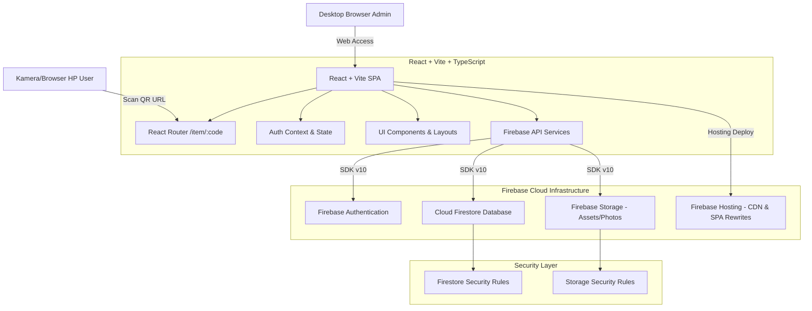
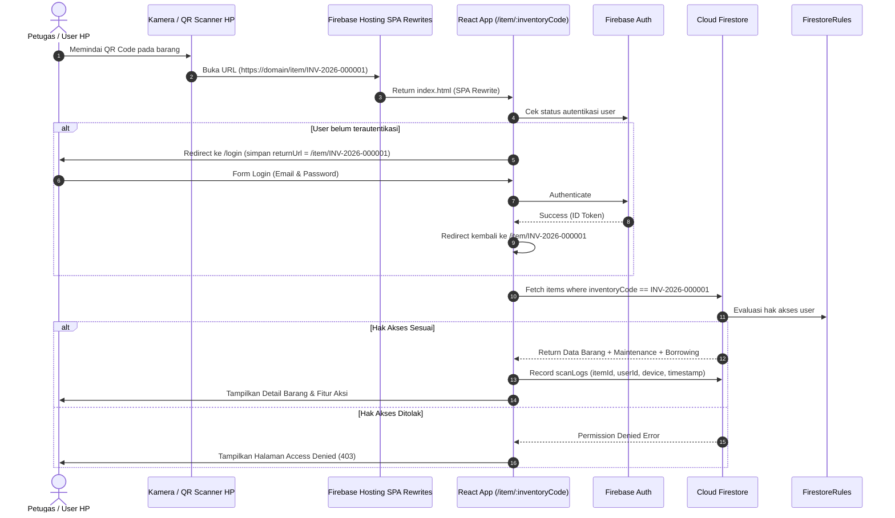

# Dokumentasi Arsitektur — Sistem Inventaris Logistik Sespimma Polri

## 1. Overview Arsitektur

Sistem Inventaris Logistik Sespimma Polri dirancang menggunakan arsitektur modern Serverless Single Page Application (SPA) berbasis React, TypeScript, dan Firebase Cloud Infrastructure.

---

## 2. Alur Utama QR Code Scan (Mobile Deep-Linking)

---

## 3. Matriks Peran & Hak Akses (Role-Based Access Control)

| Peran (Role) | Akses Dashboard | CRUD Barang | Print QR | Maintenance | Peminjaman | User Mgmt | Audit Trail |
| :--- | :---: | :---: | :---: | :---: | :---: | :---: | :---: |
| **`super_admin`** | Full | Full | Full | Full | Full | Full | Read-Only |
| **`admin`** | Full | Full | Full | Full | Full | View Only | Read-Only |
| **`petugas`** | Inspector View | Read Only | Single Print | Create & Edit | Process | No | No |
| **`user`** | Restricted | Read Allowed | Preview | View Allowed | Request | No | No |

---

## 4. Keamanan & Kebijakan Data
1. **Tidak Ada Secret di Frontend**: Kunci privat Firebase Admin SDK tidak diperbolehkan ada di aplikasi browser.
2. **Minimalisasi QR Payload**: QR Code **hanya** menyimpan URL unik (`https://domain/item/INV-YYYY-XXXXXX`), bukan data mentah barang.
3. **Pemberlakuan Aturan Keamanan Database**: Authorization ditegakkan pada tingkat server oleh **Firestore Security Rules** dan **Storage Security Rules**.
